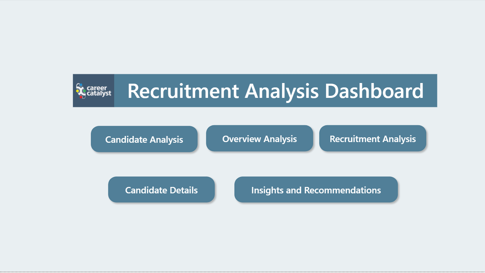
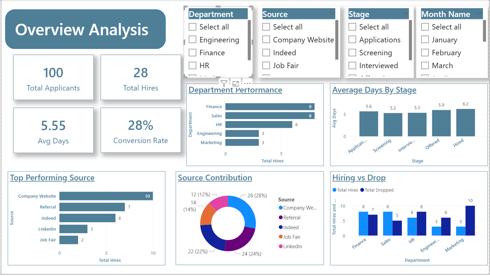
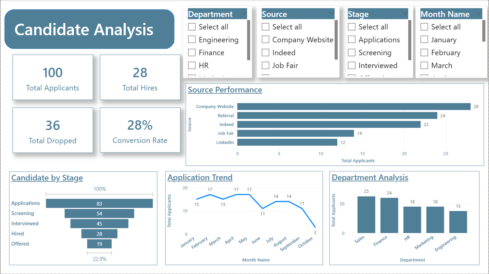
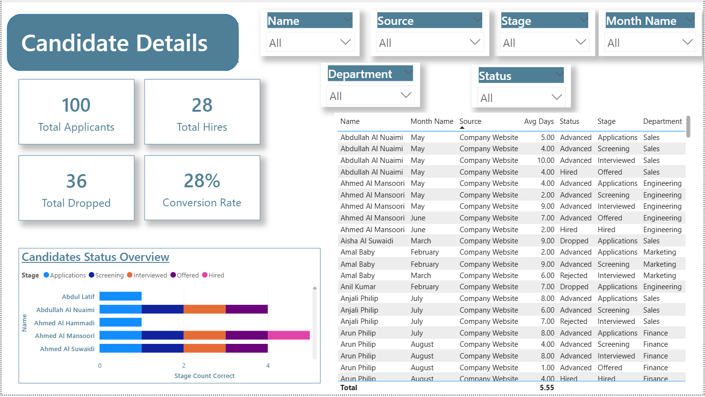
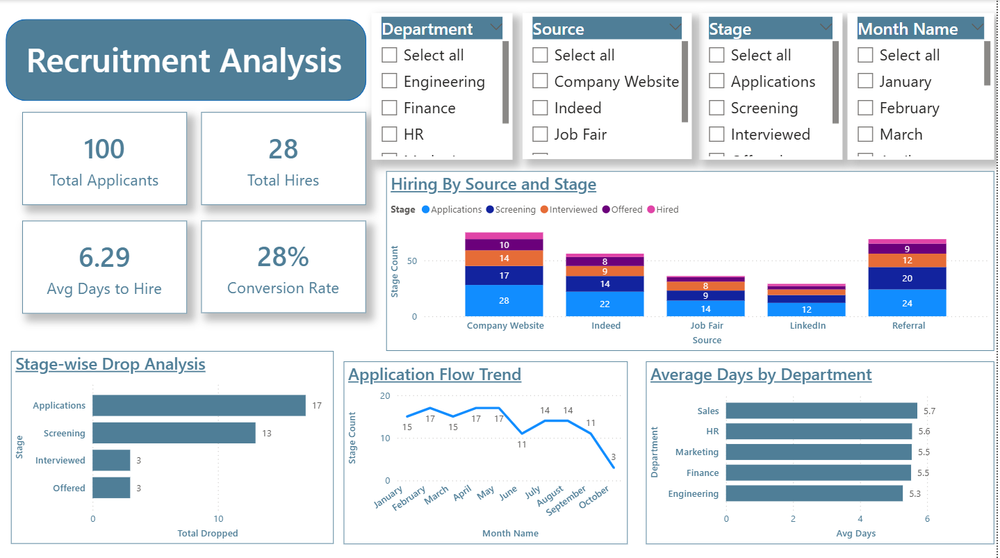
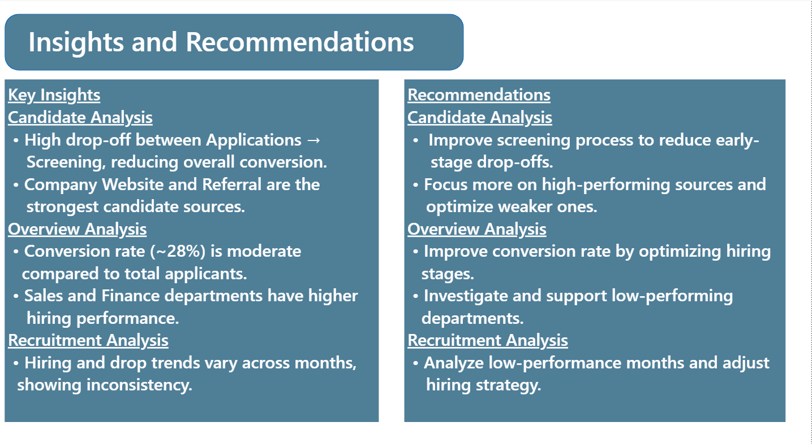

# Recruitment Dashboard (Power BI)

## 📊 Overview
This project is a Power BI dashboard designed to analyze recruitment data, track candidate progress, and provide insights into hiring performance.

---

## 🔍 Key Features
- Candidate analysis and tracking
- Recruitment pipeline visualization
- Department-wise hiring insights
- Monthly hiring trends
- KPI monitoring for recruitment performance

---

## 🛠 Tools Used
- Power BI  
- Excel  
- DAX  

---

## 📷 Dashboard Preview

### 🏠 Main Dashboard

### 📊 Overview Analysis

### 👥 Candidate Analysis

### 📋 Candidate Details

### 📈 Recruitment Analysis

### 💡 Insights & Recommendations

---

## 📁 Files
- recruitment_dashboard.pbix – Power BI dashboard file

---

## 🚀 Key Insights
- Identifies hiring trends across months
- Highlights top-performing departments in recruitment
- Tracks candidate flow through different hiring stages
- Helps improve recruitment efficiency
